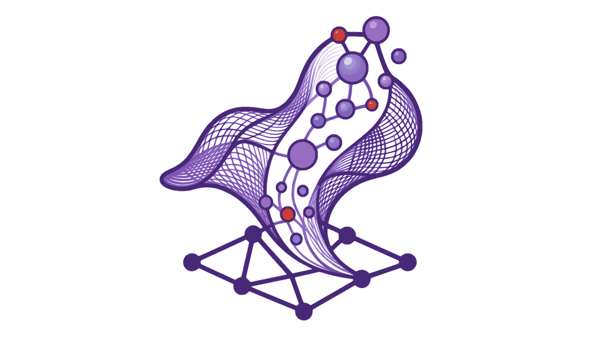

[](https://github.com/bubbleparticles/Planar.jl/actions/workflows/verify-install.yml)
[](https://planar.pages.dev/docs/)
[](https://github.com/bubbleparticles/Planar.jl/actions/workflows/docs-tests.yml)
[](https://github.com/bubbleparticles/Planar.jl/actions/workflows/build.yml)
[](https://github.com/bubbleparticles/Planar.jl/actions/workflows/tests.yml)
[](https://discord.gg/3C7YpTMXqJ)
[](https://deepwiki.com/BubbleParticles/Planar.jl)


<div align="center">
  
  <br>
  <em>Planar, advanced solutions for demanding practitioners</em>
</div>

<br>
<br>

<!-- PRESENTATION BEGIN -->

Planar is a framework designed to help you build your own trading bot. While it is primarily built around the [CCXT](https://github.com/ccxt/ccxt) API, it can be extended to work with any custom exchange, albeit with some effort.

### Customizations
Julia's dispatch mechanism makes it easy to customize any part of the bot without feeling like you are monkey patching code. It allows you to easily implement ad-hoc behavior to solve exchange API inconsistencies (despite CCXT's best efforts at unification). You don't have to wait for upstream to fix some annoying exchange issue, you can fix most things by dispatching a function instead of having to maintain a fork with a patchset. Ad-hoc customizations are non-intrusive.

### Margin and Leverage
Most open-source trading frameworks don't have a fully thought-out system for handling margined positions. Planar employs a type hierarchy that can handle isolated and cross margin trading, with hedged or unhedged positions. (However, only isolated unhedged positions management is currently implemented, PRs welcome).

### Large Datasets
Strategies can take a lot of data but not everything can fit into memory. Planar addresses this issue head-on by relying on [Zarr.jl](https://github.com/JuliaIO/Zarr.jl) for persistence of OHLCV timeseries (and other) with the ability to access data progressively chunk by chunk. It also allows you to _save_ data chunk by chunk.

### Data Consistency
When dealing with timeseries we want to make sure data is _sane_. More than other frameworks, Planar goes the extra mile to ensure that OHLCV data does not have missing entries, requiring data to be contiguous. During IO, we check the dates index to ensure data is always properly appended or prepended to existing ones.

### Data Feeds
Many frameworks are eager to provide data that you can use to develop your strategies with backtesting in mind, but leave you hanging when it comes to pipeline fresh data into live trading. Planar provides a standard interface that makes it easier to build jobs that fetch, process and store data feeds to use in real-time.

### Lookahead Bias
Dealing with periods of time is crucial for any trading strategy, yet many trading frameworks gloss over this not so small detail causing repeated lookahead bias bugs. Planar implements a full-featured library to handle parsing and conversions of both dates and timeframes. It has convenient macros to handle date periods and timeframes within the REPL and provides indexing by date and range of dates for dataframes.

### Multiplicity
Handling a large number of strategies can be cumbersome and brittle. Planar doesn't step on your toes when you are trying to piece everything together, because there are no requirements for a runtime environment, there is no overly complicated setup, starting and stopping strategies is as easy as calling `start!` and `stop!` on the strategy object. That's it. You can construct higher-level cross-currency or cross-exchange systems by just instantiating multiple strategies.

### Peculiar Backtesting
Other frameworks build the backtester like an event-driven "simulated" exchange such that they can mirror as precise as possible real-world exchanges. In Planar instead, the backtester is functionally a loop, with execution implemented _from scratch_. This makes the backtester:
- Simpler to debug (it is _self-contained_)
- Faster (it is _synchronous_)
- Friendlier to parameter optimization (it is _standalone_ and easy to parallelize)

### By-Simulation
The fine-grained ability to simulate orders and trades allows us to run the simulation *even during live trading*. This means that we can either tune our simulation against our chosen live trading exchange, or be alerted about exchange misbehavior when our simulation diverges from exchange execution. Achieving this with an event-driven backtester ends up being either very hard, a brittle mess or simply impossible. This is a unique feature of Planar that no other framework provides and we called it _by-simulation_[^1].

### Low Strategy Code Duplication
In every execution mode, there is always a view of the strategy state which is local first, there is full access to orders, trades history, balances. What differs between the execution modes is not what but how all our internal data structures are populated, which is abstracted away from the user. From the user perspective, strategy code works the same during backtesting, paper and live trading. Yet the user can still choose to branch execution on different modes, for example, to pre-fill some data during simulations, the strategy is of course always self-aware of what mode it is running in.

### Thin Abstractions
Other frameworks achieve low code duplication by completely abstracting away order management and instead provide a _signal_ interface. Planar abstractions are thin, from the strategy, you are sending orders directly yourself, there is no man in the middle, you decide how, what, when to enter or exit trades. If you want a higher level of abstractions like signals and risk management, those can be implemented as modules that the strategy depends on, PRs welcome.

## Planar also...
- Can plot OHLCV data, custom indicators, trades history, asset balance history
- Can perform parameter optimization using grid search, evolution and Bayesian opt algorithms. Has restore/resume capability and plotting of the optimization space.
- In Paper mode, trades are simulated using the real order book and exchange trades history
- Has a Telegram bot to control strategies
- Can download data from external archives in parallel, and has API wrappers for crypto APIs.
- Can still easily call into python (with async support!) if you wish

## System Recommendations

| 🪙 Symbols | 💾 RAM | 🧠 CPU |
|------------|--------|--------|
| 10         | 1 GB   | 1      |
| 100        | 4 GB   | 2      |

*Note: OHLCV data can be shared among strategies.*

<!-- PRESENTATION END -->

## Install
### With docker
For developing strategies:
``` bash
# Sysimage build (the largest number of methods precompiled) plus interactive modules (plotting and optimization)
docker pull docker.io/bubbleparticles/planar-sysimage-interactive

```
For running live strategies
``` bash
# Sysimage build with only the core components, better for live deployments
docker pull docker.io/bubbleparticles/planar-sysimage
```

For developing planar

``` bash
# Precomp build. Slower loading times, smaller image
docker pull docker.io/bubbleparticles/planar-precomp-interactive
# Precomp build without interactive modules
docker pull docker.io/bubbleparticles/planar-precomp
```

### From the Julia registry (recommended)

Planar is distributed through the community `PlanarRegistry`. Requires Julia
1.9+. In any Julia environment:

```julia
using Pkg
Pkg.Registry.add(RegistrySpec(url = "https://github.com/BubbleParticles/PlanarRegistry.git"))
Pkg.add("Planar")
```

Then `using Planar`. (If you installed Planar manually before the registry
existed, remove the old copy first: `Pkg.rm("Planar")`.)

### Via pip (planar CLI)

The `planar` command-line driver is on PyPI as `planarjl-py`:

```bash
pip install planarjl-py
planar init mybot
cd mybot
planar run MyStrategy --mode sim
```

It sets up the Julia project (registry + `Pkg.add("Planar")`), creates
`user/planar.toml` and `user/strategies/`, and runs strategies in sim, paper,
or live mode.

See [`PACKAGING.md`](PACKAGING.md) for the full packaging/registration story.

### From sources
Planar.jl requires at least Julia 1.9. Is not in the julia registry, to install it do the following:

- Clone the repository:
```bash
git clone --recurse-submodules https://github.com/defnlnotme/Planar.jl
```
- Check the env vars in `.envrc`, then enabled them with `direnv allow`.
```bash
cd Planar.jl
direnv allow
```
- Activate the project specified by `JULIA_PROJECT` in the `.envrc`.
```bash
julia 
```
- Download and build dependencies:
```julia
] instantiate
using Planar  # or PlanarOptim for plotting and optimization
```


## ⚠️ Experimental Features

The following capabilities are functional and covered by tests, but are
considered **experimental** — APIs may still shift and edge cases may surface
in production. Use them with care and report issues.

### Tick-based Backtesting
- `SimMode.start!(s::Strategy{Sim}, ctx::TickContext; ...)` and the
  `TradeTickRange` entry points run the backtester as a literal tick loop over
  a `TickContext` rather than a coarse bar replay. This exercises the same
  per-tick `update!`/`ping!` pipeline used by live trading, so simulation
  fidelity is higher than bar-only backtests.
- A `universe_schedule::Vector{Tuple{DateTime,Vector{String}}}` argument can be
  passed to `start!` to replay timed universe changes (assets added/removed at
  specific timestamps) during a backtest, letting you reproduce a dynamic
  universe historically.

### Cross Margin & Hedged Strategies
- Margin modes `Cross`, `CrossHedged`, `Isolated`, `IsolatedHedged`
  (`CrossMargin`/`IsolatedMargin` parameterized by `Hedged`/`NotHedged`) are
  supported alongside `NoMargin`.
- All four margin modes are implemented end-to-end across `SimMode`, `PaperMode`,
  and `LiveMode`: order creation, position open/close, leverage updates, liquidation
  sweeps, and watcher-driven position/balance reconciliation (both one-way and
  hedged long+short). Live margin-mode enforcement is applied per asset instance via
  `ensure_marginmode` before each order/close.
- Margin-mode instruments must be **derivative** symbols (e.g. `BTC/USDT:USDT`,
  parsed as a `Derivative`), not plain spot `Instrument`s; building a margined
  instance from a spot symbol fails at construction.

### Dynamic Universe
- Assets can be added or removed from a running strategy **without restart**
  via `addasset!` / `removeasset!` / `replace_universe!`. Mutations are
  atomic under the collection lock and emit `on_universe_change!` callbacks
  (with `on_universe_added` / `on_universe_removed` lifecycle hooks).
- Works in `Sim`, `Paper`, and `Live` modes. Watchers, the data plane, and
  execution plane all react to universe events (backfill/stop per symbol,
  orphan-order policy on remove).
- Universe membership can be persisted (`save_universe!` / `load_universe!`)
  and overridden at config time via `[universe] members = [...]` in
  `planar.toml` (or `config.attrs["universe"]["members"]`).
- **Caveat:** removing an asset that has open orders/positions follows the
  strategy's `:on_remove_with_open_orders` / `:on_remove_with_position`
  policy (`cancel`/`hold`/`close`); verify your policy matches your risk
  tolerance before relying on hot removal in live trading.

See [`docs/dynamic-universe.md`](docs/dynamic-universe.md) for the full
contract, invariants, and the chaos/fuzz harness.

Read the :book: documentation ([link](https://planar.pages.dev/docs/)) to learn how to get started with the bot.
