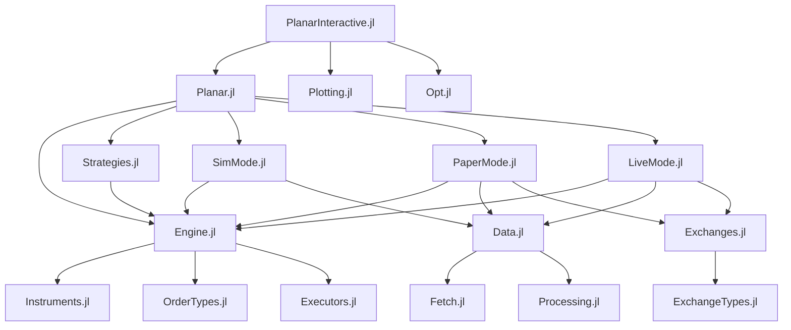
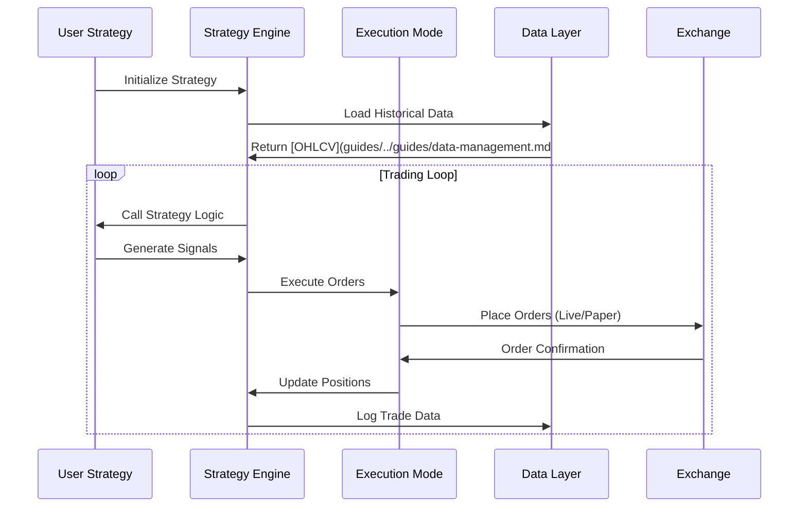

# Development Documentation

This comprehensive guide covers Planar's architecture, development setup, contribution guidelines, and best practices for extending the framework.

## Architecture Overview

### System Architecture

Planar follows a modular architecture with clear separation of concerns:

```
┌─────────────────────────────────────────────────────────────┐
│                    User Interface Layer                     │
├─────────────────────────────────────────────────────────────┤
│  Planar.jl (Main)  │  PlanarInteractive.jl  │  CLI Tools   │
├─────────────────────────────────────────────────────────────┤
│                    Strategy Layer                           │
├─────────────────────────────────────────────────────────────┤
│   Strategies.jl    │    User Strategies     │  StrategyStats│
├─────────────────────────────────────────────────────────────┤
│                    Execution Layer                          │
├─────────────────────────────────────────────────────────────┤
│  SimMode.jl  │  PaperMode.jl  │  LiveMode.jl  │ Executors.jl│
├─────────────────────────────────────────────────────────────┤
│                    Data & Exchange Layer                    │
├─────────────────────────────────────────────────────────────┤
│ Exchanges.jl │ Data.jl │ Fetch.jl │ Processing.jl │ Metrics.jl│
├─────────────────────────────────────────────────────────────┤
│                    Foundation Layer                         │
├─────────────────────────────────────────────────────────────┤
│Engine.jl│Instruments.jl│OrderTypes.jl│Collections.jl│Lang.jl│
└─────────────────────────────────────────────────────────────┘
```

### Core Components

#### Engine Module
The foundation of Planar, providing:
- **Asset Management**: `AbstractAsset`, `Asset`, `Derivative` types
- **Instance System**: `AssetInstance` linking assets to [exchanges](exchanges.md)
- **Strategy Framework**: `Strategy{Mode}` parametric types
- **Core Abstractions**: Base types and interfaces

#### Execution Modes
Three distinct execution environments:
- **SimMode**: Fast synchronous [backtesting](guides/execution-modes.md#simulation)-mode) with [OHLCV data](guides/../guides/data-management.md#ohlcv-data)
- **PaperMode**: Real-time [simulation](guides/execution-modes.md#simulation-mode) with live data feeds
- **LiveMode**: Actual trading with [exchanges](exchanges.md) APIs

#### Data Pipeline
Comprehensive [data management](guides/../guides/data-management.md):
- **Fetch**: Data acquisition from [exchanges](exchanges.md) and external sources
- **Processing**: Data cleaning, resampling, and transformation
- **Storage**: Zarr-based large dataset storage with LMDB indexing
- **Watchers**: Real-time data monitoring and alerting

#### Exchange Integration
Unified [exchange](exchanges.md) interface:
- **[CCXT](exchanges.md#ccxt-integration) Integration**: 100+ [exchange](exchanges.md) support via Ccxt.jl
- **Custom Exchanges**: Framework for implementing proprietary APIs
- **Order Management**: Unified order types across exchanges

### Module Relationships



### Data Flow Architecture



## Development Setup

### Prerequisites

- **[Julia](https://julialang.org/) 1.11+**: Latest stable [Julia](https://julialang.org/) version
- **Git**: With submodule support
- **Python 3.8+**: For [CCXT](exchanges.md#ccxt-integration) integration (managed via CondaPkg)
- **Docker** (optional): For containerized development

### Initial Setup

1. **Clone Repository**:
```bash
git clone --recurse-submodules https://github.com/defnlnotme/Planar.jl
cd Planar.jl
```

2. **Environment Setup**:
```bash
# Enable direnv (recommended)
direnv allow

# Or manually set environment
export JULIA_PROJECT=Planar
export JULIA_NUM_THREADS=$(nproc)
```

3. **Install Dependencies**:

### Development Environment

#### Recommended Julia Setup


#### IDE Configuration

**VS Code with Julia Extension**:
```json
{
    "julia.environmentPath": "Planar",
    "julia.enableTelemetry": false,
    "julia.execution.resultDisplay": "both",
    "julia.lint.run": true,
    "julia.format.indent": 4,
    "julia.format.margin": 92
}
```

**Vim/Neovim with LanguageServer.jl**:
```lua
require'lspconfig'.julials.setup{
    settings = {
        julia = {
            environmentPath = "Planar",
            format = {
                indent = 4,
                margin = 92
            }
        }
    }
}
```

## PlanarDev Utilities

The `PlanarDev` package assists developers by providing helper functions for working with Planar and for conducting tests.

### Precompilation Control

To skip precompilation for selected modules, set the `JULIA_NOPRECOMP` environment variable:


Alternatively, you can manage environment variables with `direnv` (refer to the `.envrc` in the repository). To disable precompilation entirely for certain packages, use `JULIA_NOPRECOMP=all`. This is recommended only when altering low-level components of the module stack. Remember to clear the compilation cache when changing precompilation settings:


The `Exchanges` and `Fetch` packages contain a `compile.jl` file to generate precompile statements using [CompileBot.jl](https://github.com/aminya/CompileBot.jl). This is particularly useful for precompilation tasks that involve numerous web requests. However, this method is not currently used as it does not compile as many methods as `PrecompileTools`.

!!! warning "Custom Precompilation"
    For custom method precompilation, enclose your code with `py_start_loop` and `py_stop_loop` from the Python package to prevent Pkg from stalling due to lingering threads.

### Method Invalidation Strategy

The order of `using ...` statements when loading modules can influence method invalidation. To minimize invalidation, arrange the module imports starting with the ones most likely to cause invalidations to the ones least likely. For instance, placing `using Python` at the beginning can expedite loading times:


Modules known for heavy invalidations:

- Python
- Ccxt (initiates the Python async loop)
- Data (relies on Zarr and DataFrames)
- Plots (depends on Makie)

To reduce invalidations, include external modules in only one local package and then use that package as a dependency in other local packages. For instance, if `DataFrames` is a dependency of the local package `Data`, and you want to use `DataFrames` in the `Stats` package, do not add `DataFrames` to `Stats` dependencies. Instead, use `Data` and import `DataFrames` from there:


### Handling Segfaults

In rare cases involving complex multi-threaded scenarios, disable and re-enable the garbage collector (GC) around the loading of Planar to avoid segmentation faults:


Refer to [PythonCall.jl issue #201](https://github.com/cjdoris/PythonCall.jl/issues/201) for more details.

### Dependency Management

When adding dependencies, ensure that a dependency is only included in one subpackage. If you need the same dependency in another subpackage, add the first subpackage as the dependency, not the external module.

The order of `using` or `import` statements within packages is crucial. Always import external dependencies before internal ones to minimize method invalidations.


## See Also

- **[Exchanges](exchanges.md)** - Exchange integration and configuration
- **[Config](config.md)** - Exchange integration and configuration
- **[Overview](troubleshooting/index.md)** - Troubleshooting: Troubleshooting and problem resolution
- **[Optimization](optimization.md)** - Performance optimization techniques
- **[Performance Issues](troubleshooting/performance-issues.md)** - Troubleshooting: Performance optimization techniques
- **[Data Management](guides/../guides/data-management.md)** - Guide: Data handling and management

## Contribution Guidelines

### Code Style and Standards

#### Julia Formatting
Planar uses JuliaFormatter with Blue style:


Configuration in `.JuliaFormatter.toml`:
```toml
style = "blue"
margin = 92
indent = 4
always_for_in = true
whitespace_typedefs = true
whitespace_ops_in_indices = true
remove_extra_newlines = true
```

#### Naming Conventions

- **Types**: PascalCase (`MyCustomType`)
- **Functions**: snake_case (`my_function`)
- **Constants**: UPPER_CASE (`MY_CONSTANT`)
- **Modules**: PascalCase (`MyModule`)
- **Variables**: snake_case (`my_variable`)

#### Documentation Standards

All public functions must have docstrings:


### Testing Patterns

#### Unit Testing Structure


#### Integration Testing


#### Property-Based Testing


### Extension Best Practices

#### Creating New Modules

1. **Module Structure**:
```
MyNewModule/
├── Project.toml
├── Manifest.toml
├── src/
│   ├── MyNewModule.jl
│   ├── types.jl
│   ├── functions.jl
│   └── utils.jl
├── test/
│   ├── runtests.jl
│   └── test_functions.jl
└── README.md
```

2. **Project.toml Template**:
```toml
name = "MyNewModule"
uuid = "generate-new-uuid"
authors = ["Your Name <your.email@example.com>"]
version = "0.1.0"

[deps]
# Only essential dependencies
Engine = {path = "../Engine"}

[compat]
julia = "1.11"
```

3. **Module Definition**:

#### Implementing Custom Strategies


#### Performance Optimization Guidelines

1. **Type Stability**:

2. **Memory Allocation**:

3. **Benchmarking**:

### Debugging and Profiling

#### Debugging Strategies

1. **Logging**:

2. **Interactive Debugging**:

3. **Testing Utilities**:

#### Performance Profiling


### Continuous Integration

#### GitHub Actions Workflow

```yaml
# .github/workflows/ci.yml
name: CI
on:
  push:
    branches: [main, develop]
  pull_request:
    branches: [main]

jobs:
  test:
    runs-on: ubuntu-latest
    strategy:
      matrix:
        julia-version: ['1.11', '1.12']
    
    steps:
    - uses: actions/checkout@v3
      with:
        submodules: recursive
    
    - uses: julia-actions/setup-julia@v1
      with:
        version: ${{ matrix.julia-version }}
    
    - uses: julia-actions/cache@v1
    
    - uses: julia-actions/julia-buildpkg@v1
      with:
        project: Planar
    
    - uses: julia-actions/julia-runtest@v1
      with:
        project: Planar
    
    - uses: julia-actions/julia-processcoverage@v1
    
    - uses: codecov/codecov-action@v3
```

### Release Process

#### Version Management

1. **Semantic Versioning**: Follow SemVer (MAJOR.MINOR.PATCH)
   - MAJOR: Breaking changes
   - MINOR: New features, backward compatible
   - PATCH: Bug fixes, backward compatible

2. **Release Checklist**:
   - [ ] Update version in Project.toml
   - [ ] Update CHANGELOG.md
   - [ ] Run full test suite
   - [ ] Update documentation
   - [ ] Create release tag
   - [ ] Build and test Docker images

#### Documentation Updates


### Community Guidelines

#### Issue Reporting

When reporting issues, include:
- Julia version and Planar version
- Minimal reproducible example
- Expected vs actual behavior
- Error messages and stack traces
- System information (OS, architecture)

#### Pull Request Process

1. Fork the repository
2. Create feature branch from `develop`
3. Make changes with tests
4. Update documentation
5. Submit pull request with clear description
6. Address review feedback
7. Merge after approval

#### Code Review Standards

- **Functionality**: Does the code work as intended?
- **Performance**: Are there performance implications?
- **Style**: Does it follow project conventions?
- **Tests**: Are there adequate tests?
- **Documentation**: Is it properly documented?
- **Breaking Changes**: Are breaking changes justified and documented?

This comprehensive development guide ensures consistent, high-quality contributions to the Planar ecosystem.