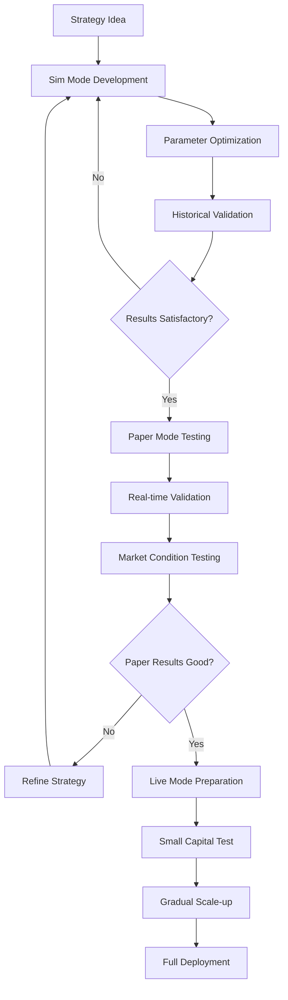

<!--
category: "strategy-development"
difficulty: "advanced"
topics: [execution-modes, margin-trading, exchanges, optimization, strategy-development, troubleshooting, visualization, configuration]
last_updated: "2025-10-04"
-->

# Execution Mode Comparison and Transition Guide

This guide provides a comprehensive comparison of Planar's three execution modes (Sim, Paper, and Live) and guidance on safely transitioning between them.

## Mode Overview

Planar supports three distinct execution modes, each designed for different stages of [strategy](../guides/strategy-development.md) development and deployment:

- **Sim Mode (Simulation/Backtesting)**: Historical data [simulation](../guides/execution-modes.md#simulation-mode) for [strategy](../guides/strategy-development.md) development and testing
- **Paper Mode**: Real-time [simulation](../guides/execution-modes.md#simulation-mode) with live [market data](../guides/data-management.md) but no actual trades
- **Live Mode**: Real trading with actual capital and [exchanges](../exchanges.md) APIs

## Detailed Mode Comparison

### Feature Comparison Matrix

| Feature | Sim Mode | Paper Mode | Live Mode |
|---------|----------|------------|-----------|
| **Data Source** | Historical | Live Market Data | Live Market Data |
| **Order Execution** | Simulated | Simulated | Real Exchange API |
| **Capital Risk** | None | None | Real Money |
| **Market Impact** | None | None | Real |
| **Latency** | None | Real Network | Real Network + Exchange |
| **Slippage** | Modeled | Modeled from Order Book | Real Market Slippage |
| **Fees** | Modeled | Modeled | Real Exchange Fees |
| **Order Book** | Historical/Modeled | Real-time | Real-time |
| **Speed** | Very Fast | Real-time | Real-time |
| **API Limits** | None | Rate Limited | Rate Limited |
| **Funding Costs** | Modeled | Modeled | Real |

### Execution Characteristics

#### Sim Mode (Backtesting)

**Best Use Cases:**
- Strategy development and debugging
- Parameter [optimization](../optimization.md)
- Historical performance analysis
- Backtesting across multiple time periods
- Monte Carlo simulations

**Performance Characteristics:**
- Speed: ~3.9M candles in 8 seconds (single core)
- Memory: 2-8GB depending on data size
- Scalability: Excellent for large datasets

#### Paper Mode

**Best Use Cases:**
- Strategy validation with live data
- Real-time performance monitoring
- Market condition adaptation testing
- Pre-live deployment validation
- Strategy parameter fine-tuning

**Performance Characteristics:**
- Speed: Real-time (limited by [market data](../guides/data-management.md) frequency)
- Memory: 1-4GB depending on complexity
- Latency: Network + processing delays

#### Live Mode

**Best Use Cases:**
- Production trading
- Real capital deployment
- Market making [strategies](../guides/strategy-development.md)
- Arbitrage opportunities
- Professional trading operations

**Performance Characteristics:**
- Speed: Limited by [exchanges](../exchanges.md) APIs
- Memory: 1-2GB for typical [strategies](../guides/strategy-development.md)
- Latency: Network + [exchanges](../exchanges.md) processing

## Transition Strategies

### Development Workflow

The recommended development workflow follows a systematic progression through all three modes:

### Sim to Paper Transition

#### Pre-transition Checklist

#### Configuration Adjustments

### Paper to Live Transition

#### Comprehensive Validation

#### Live Mode Preparation

## Common Pitfalls and How to Avoid Them

### Sim Mode Pitfalls

#### 1. Overfitting to Historical Data

#### 2. Unrealistic Execution Assumptions

### Paper Mode Pitfalls

#### 1. Ignoring Market Impact

#### 2. Over-optimizing on Current Market Conditions

### Live Mode Pitfalls

#### 1. Insufficient Capital Management

#### 2. Inadequate Risk Management

## Best Practices for Mode Transitions

### 1. Gradual Transition Approach

### 2. Validation Gates

### 3. Configuration Management

## See Also

- **[Exchanges](../exchanges.md)** - Exchange integration and configuration
- **[Config](../config.md)** - Exchange integration and configuration
- **[Overview](../troubleshooting/index.md)** - Troubleshooting: Troubleshooting and problem resolution
- **[Optimization](../optimization.md)** - Performance optimization techniques
- **[Performance Issues](../troubleshooting/performance-issues.md)** - Troubleshooting: Performance optimization techniques
- **[Data Management](../guides/data-management.md)** - Guide: Data handling and management

## Monitoring and Alerting Across Modes

### Cross-Mode Performance Tracking

This comprehensive mode comparison and transition guide provides traders with the knowledge needed to safely and effectively move their [strategies](../guides/strategy-development.md) from development through to [live trading](../guides/execution-modes.md#live-mode), while avoiding common pitfalls and maintaining proper risk management throughout the process.