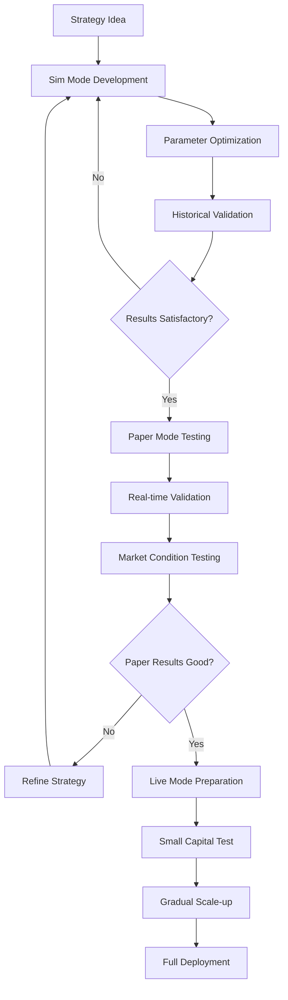

<!--
title: "Execution Modes Guide"
description: "Understanding simulation, paper, and live trading modes"
category: "guides"
difficulty: "intermediate"
topics: [execution-modes, simulation, paper-trading, live-trading]
last_updated: "2025-10-04"
-->

# Execution Modes Guide

<!--
Keywords: execution modes, [simulation](../guides/execution-modes.md#simulation-mode), [backtesting](../guides/execution-modes.md#simulationmode), [paper trading](../guides/execution-modes.md#paper-mode), [live trading](../guides/execution-modes.md#live-mode), mode transition, risk management
Description: Comprehensive guide to Planar's three execution modes - Sim, Paper, and Live - covering setup, [configuration](../config.md), transition [strategies](../guides/strategy-development.md), and best practices.
-->

This comprehensive guide covers Planar's three execution modes and how to safely transition between them. Learn how to develop [strategies](../guides/strategy-development.md) in [simulation](../guides/execution-modes.md#simulation-mode), validate them in paper mode, and deploy them for [live trading](../guides/execution-modes.md#live-mode) with proper risk management.

## Quick Navigation

- **[Mode Overview](#mode-overview)** - Understanding the three execution modes
- **[Simulation Mode](#simulation-mode)** - Backtesting with historical data
- **[Paper Mode](#paper-mode)** - Real-time simulation without capital risk
- **[Live Mode](#live-mode)** - Real trading with actual capital
- **[Mode Transitions](#mode-transitions)** - Safe progression between modes
- **[Best Practices](#best-practices)** - Guidelines for each mode
- **[troubleshooting](../troubleshooting/index.md)** - Common issues and solutions

## Prerequisites

- Completed the [Getting Started Guide](../getting-started/index.md)
- Basic understanding of [Strategy Development](strategy-development.md))
- Familiarity with [Data Management](../guides/data-management.md)

## Related Topics

- **[Strategy Development](strategy-development.md))** - Building trading [strategies](../guides/strategy-development.md)
- **[Risk Management](../advanced/risk-management.md)** - Managing trading risks
- **[optimization](../optimization.md)** - Parameter tuning and [backtesting](../guides/execution-modes.md#simulation-mode)

## Mode Overview

Planar supports three distinct execution modes, each designed for different stages of [strategy](../guides/strategy-development.md) development and deployment:

### Mode Comparison Matrix

| Feature | Sim Mode | Paper Mode | Live Mode |
|---------|----------|------------|-----------|
| **Data Source** | Historical | Live Market Data | Live Market Data |
| **Order Execution** | Simulated | Simulated | Real Exchange API |
| **Capital Risk** | None | None | Real Money |
| **Market Impact** | None | None | Real |
| **Latency** | None | Real Network | Real Network + Exchange |
| **Slippage** | Modeled | Modeled from Order Book | Real Market Slippage |
| **Fees** | Modeled | Modeled | Real Exchange Fees |
| **Order Book** | Historical/Modeled | Real-time | Real-time |
| **Speed** | Very Fast | Real-time | Real-time |
| **API Limits** | None | Rate Limited | Rate Limited |
| **Funding Costs** | Modeled | Modeled | Real |

### Development Workflow

The recommended development workflow follows a systematic progression through all three modes:



## Simulation Mode

Simulation mode (Sim) is designed for strategy development and [backtesting](../guides/execution-modes.md#simulation-mode) using historical data. It provides fast execution with no capital risk, making it ideal for initial development and [optimization](../optimization.md).

### Basic Sim Mode Setup


### Advanced Sim Configuration


### Sim Mode Features

#### Realistic Order Execution


#### Performance Optimization


#### Walk-Forward Analysis


### Sim Mode Best Practices

1. **Avoid Overfitting**: Use out-of-sample testing and walk-forward analysis
2. **Model Reality**: Include realistic slippage, fees, and execution delays
3. **Validate Assumptions**: Test across different market conditions
4. **Performance Monitoring**: Track key metrics throughout development

## Paper Mode

Paper mode provides real-time simulation using live [market data](../guides/data-management.md) without risking actual capital. It's essential for validating strategies with current market conditions before live deployment.

### Basic Paper Mode Setup


### Advanced Paper Configuration


### Paper Mode Features

#### Real-Time Order Execution

```julia
# Activate Planar project
import Pkg
Pkg.activate("Planar")

try
    using Planar
    using Dates
    @environment!

    # Define order side constants for the example
    @enum OrderSide Buy Sell

    # Helper functions for paper mode execution (implement based on your system)
    function get_order_book(ai)
        # Placeholder - replace with actual order book retrieval
        return (bids = [(50000.0, 1.0), (49999.0, 2.0)], asks = [(50001.0, 1.0), (50002.0, 2.0)])
    end

    function sweep_asks(order_book, amount)
        # Placeholder implementation
        return (50001.0, min(amount, 1.0))  # (price, filled_amount)
    end

    function sweep_bids(order_book, amount)
        # Placeholder implementation
        return (50000.0, min(amount, 1.0))  # (price, filled_amount)
    end

    # Market orders use real order book data
    function execute_market_order_paper(s, ai, side, amount)
        # Get current order book
        order_book = get_order_book(ai)
        
        # Calculate execution based on available liquidity
        if side == Buy
            execution_price, filled_amount = sweep_asks(order_book, amount)
        else
            execution_price, filled_amount = sweep_bids(order_book, amount)
        end
        
        # Execute with realistic slippage (example implementation)
        @info "Paper trade executed: $side $filled_amount at $execution_price"
        
        return (price = execution_price, amount = filled_amount, timestamp = now())
    end
    
    println("Paper trading functions defined successfully")
    
catch e
    @warn "Planar not available: $e"
end
```

#### Live Data Integration

```julia
# Activate Planar project
import Pkg
Pkg.activate("Planar")

try
    using Planar
    @environment!

    # Helper functions for live monitoring (implement based on your system)
    function isrunning(s)
        return true  # Placeholder - replace with actual strategy status check
    end

    function get_live_price(ai)
        return 50000.0 + rand() * 1000  # Placeholder live price
    end

    function update_strategy_price!(s, ai, price)
        @info "Updated price for $(ai.symbol): $price"
    end

    function analyze_order_book(ai)
        return (spread_pct = rand() * 0.5, depth = rand() * 100)  # Placeholder analysis
    end

    # Set up real-time data monitoring
    function setup_live_monitoring(s)
        @async begin
            while isrunning(s)
                # Example universe iteration (in real usage, s.universe would be defined)
                example_symbols = ["BTC/USDT", "ETH/USDT"]
                
                for symbol in example_symbols
                    # Update live prices
                    current_price = get_live_price(symbol)
                    @info "Updated price for $symbol: $current_price"
                    
                    # Monitor order book changes
                    book_analysis = analyze_order_book(symbol)
                    if book_analysis.spread_pct > 0.2  # Wide spread alert
                        @warn "Wide spread detected for $symbol: $(book_analysis.spread_pct)%"
                    end
                end
                sleep(1)  # Update every second
            end
        end
    end
    
    println("Live monitoring functions defined successfully")
    
catch e
    @warn "Planar not available: $e"
end
```

#### Performance Tracking


### Paper Mode Best Practices

1. **Conservative Sizing**: Use smaller position sizes than in simulation
2. **Monitor Spreads**: Watch for wide spreads that affect execution
3. **Test Market Conditions**: Run during different market volatility periods
4. **Validate Timing**: Ensure strategy works with real-time data delays

## Live Mode

Live mode executes real trades with actual capital using [exchanges](../exchanges.md) APIs. This mode requires careful setup, comprehensive risk management, and continuous monitoring.

### Basic Live Mode Setup


### Advanced Live Configuration


### Live Mode Features

#### Real-Time Risk Management


#### Emergency Procedures


#### Event Tracing and Analysis


### Live Mode Best Practices

1. **Start Small**: Begin with minimal capital and position sizes
2. **Monitor Continuously**: Set up comprehensive monitoring and alerts
3. **Test Thoroughly**: Use sandbox mode extensively before going live
4. **Risk Management**: Implement multiple layers of risk controls
5. **Emergency Procedures**: Have clear emergency stop procedures

## Mode Transitions

Safe transition between modes is crucial for successful strategy deployment. Each transition requires validation and configuration adjustments.

### Sim to Paper Transition

#### Pre-transition Validation


#### Configuration Adjustments


### Paper to Live Transition

#### Comprehensive Validation


#### Live Mode Preparation


### Gradual Deployment Strategy

```julia
# Activate Planar project
import Pkg
Pkg.activate("Planar")

try
    using Planar
    @environment!

    # Helper functions for deployment (implement based on your system)
    function check_milestone(s, milestone)
        # Placeholder - implement actual milestone checking
        return rand() > 0.8  # Random success for example
    end

    function add_capital!(s, amount)
        @info "Adding $amount to strategy capital"
    end

    function send_alert(s, message)
        @info "Alert: $message"
    end

    # Implement gradual capital deployment
    function implement_gradual_deployment(s, total_capital, deployment_schedule)
        current_deployment = 0.0
        
        for (milestone, capital_pct) in deployment_schedule
            # Wait for milestone achievement
            while !check_milestone(s, milestone)
                sleep(3600)  # Check every hour
            end
            
            # Increase capital allocation
            new_deployment = total_capital * capital_pct
            additional_capital = new_deployment - current_deployment
            
            if additional_capital > 0
                add_capital!(s, additional_capital)
                current_deployment = new_deployment
                
                @info "Capital deployment milestone reached" milestone capital_pct current_deployment
                send_alert(s, "Deployed $(round(capital_pct*100))% of capital ($current_deployment USDT)")
            end
        end
    end

    # Example deployment schedule
    deployment_schedule = [
        (:first_week_profitable, 0.1),    # 10% after first profitable week
        (:month_positive, 0.25),          # 25% after first profitable month
        (:three_months_stable, 0.5),     # 50% after three stable months
        (:six_months_proven, 1.0)        # 100% after six months of success
    ]
    
    println("Gradual deployment functions defined successfully")
    
catch e
    @warn "Planar not available: $e"
end
```

## Best Practices

### Development Workflow

1. **Start in Sim Mode**: Develop and optimize strategies using historical data
2. **Validate Thoroughly**: Use walk-forward analysis and out-of-sample testing
3. **Test in Paper Mode**: Validate with real market conditions for at least 30 days
4. **Deploy Gradually**: Start live trading with small capital and scale up slowly
5. **Monitor Continuously**: Implement comprehensive monitoring and alerting

### Risk Management

1. **Position Sizing**: Use conservative position sizes, especially when transitioning
2. **Stop Losses**: Implement multiple layers of stop-loss protection
3. **Diversification**: Avoid concentration in correlated assets
4. **Capital Limits**: Set strict daily and total loss limits
5. **Emergency Procedures**: Have clear emergency stop procedures

### Configuration Management


## Troubleshooting

### Common Issues by Mode

#### Sim Mode Issues

**Problem**: Strategy works perfectly in simulation but fails in paper mode
**Solution**: 
- Add realistic slippage and execution delays
- Use out-of-sample testing
- Implement proper risk management

**Problem**: Slow [backtest](../guides/execution-modes.md#simulation-mode) performance
**Solution**:
- Enable parallel processing
- Use data chunking
- Optimize strategy logic

#### Paper Mode Issues

**Problem**: Orders not filling as expected
**Solution**:
- Check order book depth
- Adjust limit order prices
- Consider using market orders for urgent trades

**Problem**: Performance differs significantly from simulation
**Solution**:
- Analyze execution quality
- Check for wide spreads
- Validate market impact assumptions

#### Live Mode Issues

**Problem**: API connection failures
**Solution**:
- Implement connection resilience
- Use proper timeout settings
- Set up reconnection logic

**Problem**: Unexpected losses
**Solution**:
- Review risk management settings
- Check for slippage and fees
- Analyze execution quality

### Debugging Tools


This comprehensive execution modes guide provides everything you need to safely develop, test, and deploy trading strategies across all three modes. Start with simulation for development, validate in paper mode, and deploy to live trading with proper risk management and monitoring.