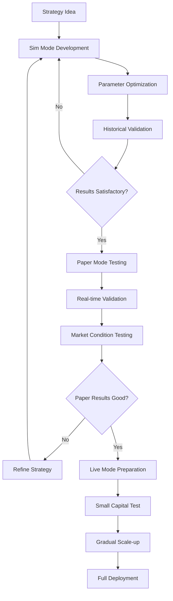

# Execution Modes Guide

<!--
Keywords: execution modes, [simulation](../guides/execution-modes.md#simulation-mode), [backtesting](../guides/execution-modes.md#[simulation](../guides/execution-modes.md#simulation-mode)-mode), [paper trading](../guides/execution-modes.md#paper-mode), [live trading](../guides/execution-modes.md#live-mode), mode transition, risk management
Description: Comprehensive guide to Planar's three execution modes - Sim, Paper, and Live - covering setup, [configuration](../config.md), transition [strategies](../guides/strategy-development.md), and best practices.
-->

This comprehensive guide covers Planar's three execution modes and how to safely transition between them. Learn how to develop [strategies](../guides/strategy-development.md) in [simulation](../guides/execution-modes.md#simulation-mode), validate them in paper mode, and deploy them for [live trading](../guides/execution-modes.md#live-mode) with proper risk management.

## Quick Navigation

- **[Mode Overview](#mode-overview)** - Understanding the three execution modes
- **[Simulation Mode](#simulation-mode)** - Backtesting with historical data
- **[Paper Mode](#paper-mode)** - Real-time simulation without capital risk
- **[Live Mode](#live-mode)** - Real trading with actual capital
- **[Mode Transitions](#mode-transitions)** - Safe progression between modes
- **[Best Practices](#best-practices)** - Guidelines for each mode
- **[Troubleshooting](#[troubleshooting](../troubleshooting/))** - Common issues and solutions

## Prerequisites

- Completed the [Getting Started Guide](../getting-started/index.md)
- Basic understanding of [Strategy Development]([strategy](../guides/strategy-development.md)-development.md)
- Familiarity with [Data Management](data-management.md)

## Related Topics

- **[Strategy Development]([strategy](../guides/strategy-development.md)-development.md)** - Building trading [strategies](../guides/strategy-development.md)
- **[Risk Management](../advanced/risk-management.md)** - Managing trading risks
- **[Optimization](../[optimization](../optimization.md).md)** - Parameter tuning and [backtesting](../guides/execution-modes.md#simulation-mode)

## Mode Overview

Planar supports three distinct execution modes, each designed for different stages of [strategy](../guides/strategy-development.md) development and deployment:

### Mode Comparison Matrix

| Feature | Sim Mode | Paper Mode | Live Mode |
|---------|----------|------------|-----------|
| **Data Source** | Historical | Live Market Data | Live Market Data |
| **Order Execution** | Simulated | Simulated | Real Exchange API |
| **Capital Risk** | None | None | Real Money |
| **Market Impact** | None | None | Real |
| **Latency** | None | Real Network | Real Network + Exchange |
| **Slippage** | Modeled | Modeled from Order Book | Real Market Slippage |
| **Fees** | Modeled | Modeled | Real Exchange Fees |
| **Order Book** | Historical/Modeled | Real-time | Real-time |
| **Speed** | Very Fast | Real-time | Real-time |
| **API Limits** | None | Rate Limited | Rate Limited |
| **Funding Costs** | Modeled | Modeled | Real |

### Development Workflow

The recommended development workflow follows a systematic progression through all three modes:



## Simulation Mode

Simulation mode (Sim) is designed for strategy development and [backtesting](../guides/execution-modes.md#simulation-mode) using historical data. It provides fast execution with no capital risk, making it ideal for initial development and [optimization](../optimization.md).

### Basic Sim Mode Setup

```julia
using Dates

# Try to load Planar with error handling
try
    using Planar
    @environment!
    
    # Create strategy in simulation mode
    s = strategy(:Example, mode=Sim())
    
    # Configure backtest parameters
    s.config.initial_cash = 10000.0
    s.config.base_size = 100.0
    s.config.start_date = DateTime("2023-01-01")
    s.config.end_date = DateTime("2023-12-31")
    
    # Load historical data
    fill!(s)
    @info "Strategy configured successfully"
catch e
    @warn "Planar strategy setup failed: $e"
    @info "This is normal in some testing environments"
end

# Run backtest
start!(s)

# Analyze results
display(s)
```

### Advanced Sim Configuration

```julia
# Comprehensive simulation setup
s = strategy(:AdvancedStrategy, mode=Sim())

# Time range [configuration](../config.md)
s.config.start_date = DateTime("2023-01-01")
s.config.end_date = DateTime("2023-12-31")
s.config.warmup_period = Day(30)  # 30 days for indicator calculation

# Capital and sizing
s.config.initial_cash = 10000.0
s.config.base_size = 100.0
s.config.max_position_size = 0.2  # Max 20% per position

# Execution modeling
s.config.slippage_model = :realistic
s.config.fee_model = :exchange_specific
s.config.partial_fills = true
s.config.execution_delay = Millisecond(100)

# Performance [optimization](../optimization.md)
s.config.parallel = true
s.config.chunk_size = 10000
s.config.show_progress = true

# Load data and run
fill!(s)
start!(s)
```

### Sim Mode Features

#### Realistic Order Execution

```julia
# Configure realistic execution modeling
s.config.slippage_model = :realistic
s.config.min_slippage = 0.001      # 0.1% minimum slippage
s.config.volume_impact = true      # Account for volume impact
s.config.partial_fills = true     # Model partial fills
s.config.fill_probability = 0.85  # 85% fill probability

# Add latency simulation
s.config.execution_delay = Millisecond(100)  # 100ms delay
```

#### Performance Optimization

```julia
# Optimize for large backtests
s.config.memory_limit = 8_000_000_000  # 8GB limit
s.config.gc_frequency = 10000          # Garbage collect frequency
s.config.chunk_processing = true       # Process in chunks
s.config.chunk_size = 50000           # 50k candles per chunk

# Enable parallel processing
ENV["JULIA_NUM_THREADS"] = "8"
s.config.parallel_assets = true       # Process assets in parallel
s.config.parallel_indicators = true   # Calculate indicators in parallel
```

#### Walk-Forward Analysis

```julia
using Planar
using Dates
@environment!

# Helper functions for walk-forward analysis
function total_return(s)
    return (cash(s) - s.config.initial_cash) / s.config.initial_cash
end

function calculate_returns(s)
    # Placeholder implementation - replace with actual returns calculation
    return rand(length(s.trades)) * 0.1 .- 0.05
end

function calculate_sharpe(returns)
    return length(returns) > 0 ? mean(returns) / std(returns) : 0.0
end

# Perform walk-forward analysis
function walk_forward_backtest(strategy_name, start_date, end_date, window_months=3)
    results = []
    current_date = start_date
    
    while current_date < end_date
        window_end = current_date + Month(window_months)
        
        s = strategy(strategy_name, mode=Sim())
        s.config.start_date = current_date
        s.config.end_date = min(window_end, end_date)
        
        fill!(s)
        start!(s)
        
        push!(results, (
            period = (current_date, s.config.end_date),
            return = total_return(s),
            trades = length(s.trades),
            sharpe = calculate_sharpe(calculate_returns(s))
        ))
        
        current_date = window_end
    end
    
    return results
end

# Run walk-forward analysis
wf_results = walk_forward_backtest(:Example, DateTime("2023-01-01"), DateTime("2023-12-31"))
```

### Sim Mode Best Practices

1. **Avoid Overfitting**: Use out-of-sample testing and walk-forward analysis
2. **Model Reality**: Include realistic slippage, fees, and execution delays
3. **Validate Assumptions**: Test across different market conditions
4. **Performance Monitoring**: Track key metrics throughout development

## Paper Mode

Paper mode provides real-time simulation using live [market data](../guides/data-management.md) without risking actual capital. It's essential for validating strategies with current market conditions before live deployment.

### Basic Paper Mode Setup

```julia
using Strategies, PaperMode

# Create strategy in paper mode
s = strategy(:Example, mode=Paper())

# Configure [paper trading](../guides/execution-modes.md#paper-mode)
s.config.initial_cash = 10000.0
s.config.throttle = 5  # seconds between strategy calls
s.config.[exchange](../[exchanges](../exchanges.md).md) = :binance

# Start [paper trading](../guides/execution-modes.md#paper-mode)
start!(s, foreground=true)
```

### Advanced Paper Configuration

```julia
# Comprehensive paper mode setup
s = strategy(:PaperStrategy, mode=Paper())

# Exchange and market [configuration](../config.md)
s.config.[exchange](../[exchanges](../exchanges.md).md) = :binance
s.config.sandbox = true  # Use testnet for testing
s.config.throttle = Second(5)

# Capital and risk management
s.config.initial_cash = 10000.0
s.config.base_size = 50.0  # Reduced from sim mode
s.config.max_position_size = 0.15  # More conservative
s.config.max_daily_loss = 100.0

# Monitoring and alerts
s.config.monitoring_enabled = true
s.config.alert_on_losses = true
s.config.log_level = :debug
s.config.log_trades = true

# Real-time data feeds
for asset in s.universe
    setup_live_data!(s, asset, ["1m", "5m"])
end

# Start with monitoring
start!(s, 
    foreground=true,
    verbose=true,
    log_file="paper_trading.log"
)
```

### Paper Mode Features

#### Real-Time Order Execution

```julia
using Planar
using Dates
@environment!

# Helper functions for paper mode execution (implement based on your system)
function get_order_book(ai)
    # Placeholder - replace with actual order book retrieval
    return (bids = [(50000.0, 1.0), (49999.0, 2.0)], asks = [(50001.0, 1.0), (50002.0, 2.0)])
end

function sweep_asks(order_book, amount)
    # Placeholder implementation
    return (50001.0, min(amount, 1.0))  # (price, filled_amount)
end

function sweep_bids(order_book, amount)
    # Placeholder implementation
    return (50000.0, min(amount, 1.0))  # (price, filled_amount)
end

# Market orders use real order book data
function execute_market_order_paper(s, ai, side, amount)
    # Get current order book
    order_book = get_order_book(ai)
    
    # Calculate execution based on available liquidity
    if side == Buy
        execution_price, filled_amount = sweep_asks(order_book, amount)
    else
        execution_price, filled_amount = sweep_bids(order_book, amount)
    end
    
    # Execute with realistic slippage (example implementation)
    @info "Paper trade executed: $side $filled_amount at $execution_price"
    
    return (price = execution_price, amount = filled_amount, timestamp = now())
end
```

#### Live Data Integration

```julia
using Planar
@environment!

# Helper functions for live monitoring (implement based on your system)
function isrunning(s)
    return true  # Placeholder - replace with actual strategy status check
end

function get_live_price(ai)
    return 50000.0 + rand() * 1000  # Placeholder live price
end

function update_strategy_price!(s, ai, price)
    @info "Updated price for $(ai.symbol): $price"
end

function analyze_order_book(ai)
    return (spread_pct = rand() * 0.5, depth = rand() * 100)  # Placeholder analysis
end

# Set up real-time data monitoring
function setup_live_monitoring(s)
    @async begin
        while isrunning(s)
            for ai in s.universe
                # Update live prices
                current_price = get_live_price(ai)
                update_strategy_price!(s, ai, current_price)
                
                # Monitor order book changes
                book_analysis = analyze_order_book(ai)
                if book_analysis.spread_pct > 0.2  # Wide spread alert
                    @warn "Wide spread detected for $(ai.symbol): $(book_analysis.spread_pct)%"
                end
            end
            sleep(1)  # Update every second
        end
    end
end
```

#### Performance Tracking

```julia
# Real-time performance monitoring
mutable struct PaperTradingMetrics
    start_time::DateTime
    initial_balance::Float64
    peak_balance::Float64
    current_drawdown::Float64
    max_drawdown::Float64
    total_trades::Int
    winning_trades::Int
    total_fees::Float64
    
    PaperTradingMetrics(initial_balance) = new(
        now(), initial_balance, initial_balance, 0.0, 0.0, 0, 0, 0.0
    )
end

function setup_performance_monitoring(s)
    metrics = PaperTradingMetrics(s.config.initial_cash)
    
    @async begin
        while isrunning(s)
            update_metrics!(metrics, s)
            
            # Log performance every 5 minutes
            @info "Paper Performance" 
                pnl=calculate_pnl(s) 
                drawdown=metrics.current_drawdown
                trades=metrics.total_trades
                win_rate=metrics.winning_trades/max(metrics.total_trades, 1)
            
            sleep(300)
        end
    end
end
```

### Paper Mode Best Practices

1. **Conservative Sizing**: Use smaller position sizes than in simulation
2. **Monitor Spreads**: Watch for wide spreads that affect execution
3. **Test Market Conditions**: Run during different market volatility periods
4. **Validate Timing**: Ensure strategy works with real-time data delays

## Live Mode

Live mode executes real trades with actual capital using [exchange](../[exchanges](../exchanges.md).md) APIs. This mode requires careful setup, comprehensive risk management, and continuous monitoring.

### Basic Live Mode Setup

```julia
using Planar
@environment!

# Create live strategy with conservative settings
s = strategy(:LiveStrategy, mode=Live())

# Configure API credentials (use environment variables)
# Note: Set these environment variables before running
s.config.api_key = get(ENV, "EXCHANGE_API_KEY", "your_api_key_here")
s.config.api_secret = get(ENV, "EXCHANGE_API_SECRET", "your_api_secret_here")
s.config.api_secret = ENV["EXCHANGE_API_SECRET"]
s.config.sandbox = false  # Set to true for testing

# Conservative initial settings
s.config.initial_cash = 1000.0  # Start small
s.config.base_size = 50.0       # Small position sizes
s.config.max_position_size = 0.1  # Max 10% per position

# Risk management
s.config.max_daily_loss = 50.0
s.config.emergency_stop = true

# Start [live trading](../guides/execution-modes.md#live-mode)
start!(s, foreground=true)
```

### Advanced Live Configuration

```julia
using Planar
@environment!

# Comprehensive live trading setup
s = strategy(:ProductionStrategy, mode=Live())

# Security configuration
s.config.api_credentials = (
    key = get(ENV, "BINANCE_API_KEY", "your_api_key"),
    secret = get(ENV, "BINANCE_API_SECRET", "your_api_secret"),
    passphrase = get(ENV, "BINANCE_PASSPHRASE", "")
)
s.config.ip_whitelist = true
s.config.api_permissions = [:trading, :reading]  # No withdrawal

# Risk management
s.config.max_daily_loss = 100.0
s.config.max_drawdown = 0.05        # 5% max drawdown
s.config.position_limit = 0.15      # Max 15% per position
s.config.correlation_limit = 0.7    # Limit correlated positions
s.config.emergency_stop = true

# Monitoring and alerts
s.config.telegram_alerts = true
s.config.email_alerts = true
s.config.comprehensive_logging = true

# Timeouts and API management
s.config.timeouts = (
    order_placement = Second(30),
    order_cancellation = Second(10),
    balance_sync = Second(15)
)

# Start with full monitoring
start!(s, 
    foreground=true,
    auto_rebalance=true,
    risk_monitoring=true
)
```

### Live Mode Features

#### Real-Time Risk Management

```julia
using Planar
@environment!

# Helper functions for risk monitoring (implement based on your system)
function calculate_total_exposure(s)
    return 0.5  # Placeholder - 50% exposure
end

function calculate_leverage_ratio(s)
    return 1.2  # Placeholder - 1.2x leverage
end

function calculate_correlation_risk(s)
    return 0.3  # Placeholder - 30% correlation risk
end

# Comprehensive risk monitoring
function setup_risk_monitoring(s)
    @async begin
        while isrunning(s)
            # Calculate risk metrics
            total_exposure = calculate_total_exposure(s)
            leverage_ratio = calculate_leverage_ratio(s)
            correlation_risk = calculate_correlation_risk(s)
            
            # Check limits
            if total_exposure > get(s.config, :max_total_exposure, 0.8)
                @error "Total exposure limit exceeded: $total_exposure"
                reduce_all_positions!(s, 0.7)
            end
            
            if leverage_ratio > s.config.max_leverage
                @error "Leverage limit exceeded: $leverage_ratio"
                close_highest_risk_positions!(s)
            end
            
            sleep(30)  # Check every 30 seconds
        end
    end
end
```

#### Emergency Procedures

```julia
using Planar
@environment!

# Helper functions for emergency procedures (implement based on your system)
function cancel_all_orders!(s)
    @info "Cancelling all pending orders for strategy $(s.name)"
end

function close_all_positions!(s)
    @info "Closing all positions for strategy $(s.name)"
end

function send_emergency_alert!(s, reason)
    @info "Emergency alert sent: $reason"
end

# Emergency stop system
function emergency_stop!(s, reason="Manual trigger")
    @error "EMERGENCY STOP TRIGGERED: $reason"
    
    # Stop strategy execution
    stop!(s)
    
    # Cancel all pending orders
    cancel_all_orders!(s)
    
    # Optionally close positions
    if get(s.config, :emergency_close_positions, false)
        close_all_positions!(s)
    end
    
    # Send alerts
    send_emergency_alert!(s, reason)
end

# Automated circuit breakers
function setup_circuit_breakers(s)
    # Daily loss circuit breaker
    @async begin
        daily_start_balance = calculate_total_balance(s)
        
        while isrunning(s)
            current_balance = calculate_total_balance(s)
            daily_pnl = current_balance - daily_start_balance
            
            if daily_pnl < -s.config.max_daily_loss
                emergency_stop!(s, "Daily loss limit exceeded: $(round(daily_pnl, digits=2))")
                break
            end
            
            sleep(60)
        end
    end
end
```

#### Event Tracing and Analysis

```julia
# Access event trace for analysis
exc = getexchange!(:binance)
et = exc._trace

# Extract recent events
events = trace_tail(et, n=100; as_df=true)

# Analyze trading performance
function analyze_live_performance(s)
    events = trace_tail(exc._trace, n=1000; as_df=true)
    
    # Calculate execution quality metrics
    order_events = filter(e -> e.type in ["order_placed", "order_filled"], events)
    fill_rate = count(e -> e.type == "order_filled", order_events) / length(order_events) * 100
    
    # Calculate average execution time
    execution_times = calculate_execution_times(events)
    avg_execution_time = mean(execution_times)
    
    return (
        fill_rate = fill_rate,
        avg_execution_time = avg_execution_time,
        total_events = length(events)
    )
end
```

### Live Mode Best Practices

1. **Start Small**: Begin with minimal capital and position sizes
2. **Monitor Continuously**: Set up comprehensive monitoring and alerts
3. **Test Thoroughly**: Use sandbox mode extensively before going live
4. **Risk Management**: Implement multiple layers of risk controls
5. **Emergency Procedures**: Have clear emergency stop procedures

## Mode Transitions

Safe transition between modes is crucial for successful strategy deployment. Each transition requires validation and configuration adjustments.

### Sim to Paper Transition

#### Pre-transition Validation

```julia
# Validate simulation results before paper mode
function validate_sim_results(s)
    checklist = Dict(
        :positive_returns => total_return(s) > 0,
        :reasonable_sharpe => sharpe_ratio(s) > 1.0,
        :max_drawdown_acceptable => max_drawdown(s) < 0.2,
        :sufficient_trades => length(s.trades) > 100,
        :win_rate_reasonable => win_rate(s) > 0.4,
        :profit_factor_good => profit_factor(s) > 1.2
    )
    
    passed = all(values(checklist))
    
    if !passed
        @warn "Sim validation failed" checklist
        return false
    end
    
    @info "Sim validation passed" checklist
    return true
end
```

#### Configuration Adjustments

```julia
# Prepare strategy for paper mode
function prepare_for_paper_mode(sim_strategy)
    paper_strategy = strategy(sim_strategy.name, mode=Paper())
    
    # Copy base configuration
    copy_strategy_config!(paper_strategy, sim_strategy)
    
    # Apply paper mode adjustments
    paper_strategy.config.base_size *= 0.5  # Reduce position sizes
    paper_strategy.config.max_position_size = min(paper_strategy.config.max_position_size, 0.1)
    paper_strategy.config.stop_loss_pct = max(paper_strategy.config.stop_loss_pct, 0.02)
    
    # Enable monitoring
    paper_strategy.config.log_level = :debug
    paper_strategy.config.monitor_performance = true
    paper_strategy.config.alert_on_losses = true
    
    return paper_strategy
end
```

### Paper to Live Transition

#### Comprehensive Validation

```julia
# Helper functions for validation (implement based on your metrics system)
function calculate_trading_days(s)
    # Example implementation - replace with actual logic
    return 45  # Example: 45 days of trading
end

function calculate_performance_metrics(s)
    # Example implementation - replace with actual metrics calculation
    return (
        total_pnl = 150.0,
        consistency_score = 0.7,
        max_drawdown = 0.12,
        sharpe_ratio = 0.9,
        total_trades = 75,
        win_rate = 0.4
    )
end

# Validate paper mode performance
function validate_paper_performance(s, min_days=30)
    trading_days = calculate_trading_days(s)
    if trading_days < min_days
        @error "Insufficient paper trading period: $trading_days days (minimum: $min_days)"
        return false
    end
    
    metrics = calculate_performance_metrics(s)
    
    validation_criteria = Dict(
        :positive_pnl => metrics.total_pnl > 0,
        :consistent_performance => metrics.consistency_score > 0.6,
        :acceptable_drawdown => metrics.max_drawdown < 0.15,
        :good_sharpe => metrics.sharpe_ratio > 0.8,
        :sufficient_trades => metrics.total_trades > 50,
        :stable_win_rate => metrics.win_rate > 0.35
    )
    
    passed_criteria = sum(values(validation_criteria))
    total_criteria = length(validation_criteria)
    
    if passed_criteria < total_criteria * 0.8  # 80% pass rate
        @error "Paper validation failed" validation_criteria
        return false
    end
    
    @info "Paper validation passed ($passed_criteria/$total_criteria criteria)" validation_criteria
    return true
end
```

#### Live Mode Preparation

```julia
using Planar
@environment!

# Helper functions for live mode preparation (implement based on your system)
function copy_strategy_config!(target, source)
    @info "Copying configuration from $(source.name) to $(target.name)"
end

function setup_live_monitoring!(s)
    @info "Setting up live monitoring for $(s.name)"
end

function setup_emergency_procedures!(s)
    @info "Setting up emergency procedures for $(s.name)"
end

# Prepare for live mode deployment
function prepare_for_live_mode(paper_strategy)
    live_strategy = strategy(paper_strategy.name, mode=Live())
    
    # Copy validated configuration
    copy_strategy_config!(live_strategy, paper_strategy)
    
    # Apply live mode safety settings
    live_strategy.config.base_size *= 0.3  # Start with 30% of paper size
    live_strategy.config.max_daily_loss = 100.0
    live_strategy.config.max_total_exposure = 0.5
    live_strategy.config.emergency_stop = true
    
    # Set up monitoring
    setup_live_monitoring!(live_strategy)
    setup_emergency_procedures!(live_strategy)
    
    return live_strategy
end
```

### Gradual Deployment Strategy

```julia
# Implement gradual capital deployment
function implement_gradual_deployment(s, total_capital, deployment_schedule)
    current_deployment = 0.0
    
    for (milestone, capital_pct) in deployment_schedule
        # Wait for milestone achievement
        while !check_milestone(s, milestone)
            sleep(3600)  # Check every hour
        end
        
        # Increase capital allocation
        new_deployment = total_capital * capital_pct
        additional_capital = new_deployment - current_deployment
        
        if additional_capital > 0
            add_capital!(s, additional_capital)
            current_deployment = new_deployment
            
            @info "Capital deployment milestone reached" milestone capital_pct current_deployment
            send_alert(s, "Deployed $(round(capital_pct*100))% of capital ($current_deployment USDT)")
        end
    end
end

# Example deployment schedule
deployment_schedule = [
    (:first_week_profitable, 0.1),    # 10% after first profitable week
    (:month_positive, 0.25),          # 25% after first profitable month
    (:three_months_stable, 0.5),     # 50% after three stable months
    (:six_months_proven, 1.0)        # 100% after six months of success
]
```

## Best Practices

### Development Workflow

1. **Start in Sim Mode**: Develop and optimize strategies using historical data
2. **Validate Thoroughly**: Use walk-forward analysis and out-of-sample testing
3. **Test in Paper Mode**: Validate with real market conditions for at least 30 days
4. **Deploy Gradually**: Start live trading with small capital and scale up slowly
5. **Monitor Continuously**: Implement comprehensive monitoring and alerting

### Risk Management

1. **Position Sizing**: Use conservative position sizes, especially when transitioning
2. **Stop Losses**: Implement multiple layers of stop-loss protection
3. **Diversification**: Avoid concentration in correlated assets
4. **Capital Limits**: Set strict daily and total loss limits
5. **Emergency Procedures**: Have clear emergency stop procedures

### Configuration Management

```julia
# Manage configurations across modes
struct ModeConfiguration
    sim_config::Dict{Symbol, Any}
    paper_config::Dict{Symbol, Any}
    live_config::Dict{Symbol, Any}
end

function create_mode_configurations()
    base_config = Dict(
        :initial_cash => 10000.0,
        :base_size => 100.0,
        :max_position_size => 0.2,
        :stop_loss_pct => 0.02
    )
    
    sim_config = merge(base_config, Dict(
        :slippage_model => :realistic,
        :fee_model => :exchange_specific
    ))
    
    paper_config = merge(base_config, Dict(
        :base_size => base_config[:base_size] * 0.5,
        :max_position_size => 0.15,
        :monitoring_enabled => true
    ))
    
    live_config = merge(base_config, Dict(
        :base_size => base_config[:base_size] * 0.3,
        :max_position_size => 0.1,
        :emergency_stop => true
    ))
    
    return ModeConfiguration(sim_config, paper_config, live_config)
end
```

## Troubleshooting

### Common Issues by Mode

#### Sim Mode Issues

**Problem**: Strategy works perfectly in simulation but fails in paper mode
**Solution**: 
- Add realistic slippage and execution delays
- Use out-of-sample testing
- Implement proper risk management

**Problem**: Slow [backtest](../guides/execution-modes.md#simulation-mode) performance
**Solution**:
- Enable parallel processing
- Use data chunking
- Optimize strategy logic

#### Paper Mode Issues

**Problem**: Orders not filling as expected
**Solution**:
- Check order book depth
- Adjust limit order prices
- Consider using market orders for urgent trades

**Problem**: Performance differs significantly from simulation
**Solution**:
- Analyze execution quality
- Check for wide spreads
- Validate market impact assumptions

#### Live Mode Issues

**Problem**: API connection failures
**Solution**:
- Implement connection resilience
- Use proper timeout settings
- Set up reconnection logic

**Problem**: Unexpected losses
**Solution**:
- Review risk management settings
- Check for slippage and fees
- Analyze execution quality

### Debugging Tools

```julia
# Debug mode transitions
function debug_mode_transition(from_strategy, to_mode)
    @info "Debugging mode transition" from_mode=typeof(from_strategy.mode) to_mode=to_mode
    
    # Compare configurations
    config_diff = compare_configurations(from_strategy.config, default_config(to_mode))
    @info "Configuration differences" config_diff
    
    # Validate transition readiness
    validation_result = validate_transition_readiness(from_strategy, to_mode)
    @info "Transition validation" validation_result
    
    return validation_result
end

# Performance comparison across modes
function compare_mode_performance(strategies)
    comparison = Dict()
    
    for (mode, strategy) in strategies
        comparison[mode] = Dict(
            :total_return => total_return(strategy),
            :sharpe_ratio => sharpe_ratio(strategy),
            :max_drawdown => max_drawdown(strategy),
            :win_rate => win_rate(strategy),
            :total_trades => length(strategy.trades)
        )
    end
    
    return comparison
end
```

This comprehensive execution modes guide provides everything you need to safely develop, test, and deploy trading strategies across all three modes. Start with simulation for development, validate in paper mode, and deploy to live trading with proper risk management and monitoring.