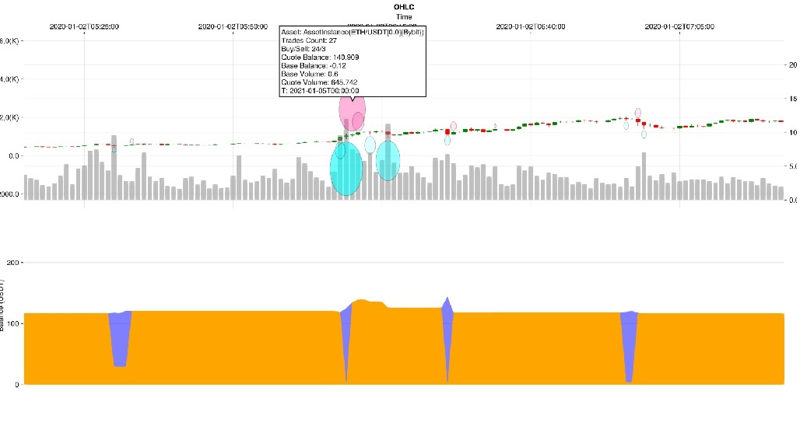

# Plotting and Visualization

The Plotting module utilizes [Makie](https://docs.makie.org/stable/) for creating visualizations. It is important to note that graphical backends are not automatically included with the module and must be installed manually:


Planar enhances Makie with specialized plotting recipes for financial analysis:

- [OHLCV](guides/../guides/data-management.md#ohlcv-data) (Open-High-Low-Close Volume) charts
- Detailed trade history visualization
- Summarized trade history with volume and balance insights
- Custom indicator overlays and channels
- Multi-asset portfolio visualization
- Performance and [optimization](optimization.md) result analysis

!!! info "Interactive Features"
    Interactive backends, such as GLMakie and WGLMakie, allow for dynamic plots that can be clicked-and-dragged or zoomed. Additionally, interactive elements like tooltips are available on hover for candlesticks, trades, and balance charts.

## Backend Selection and Setup

### GLMakie (Desktop Applications)

GLMakie is the recommended backend for desktop applications and provides the best performance for interactive plots:


### WGLMakie (Web Applications)

WGLMakie is ideal for web-based applications and Jupyter notebooks:


### CairoMakie (Static Images)

For generating static images or when interactive features are not needed:

For generating static images, use CairoMakie and save with `save("chart.png", figure)`.

## [OHLCV](guides/../guides/data-management.md#ohlcv-data) Charts

[OHLCV data](guides/../guides/data-management.md#ohlcv-data) is represented using candlesticks to indicate price movement, with red signifying a price decrease and green an increase. Volume is depicted as bars in the background of the chart.

### Basic [OHLCV](guides/../guides/data-management.md#ohlcv-data) Chart


### Customizing OHLCV Charts

You can customize various aspects of OHLCV charts:

Customize charts with parameters like `title`, `up_color`, `down_color`, `volume_color`, and `show_volume`.

### Time Range Selection

Display specific time periods:


### Multiple Timeframes

Compare different [timeframes](guides/../guides/data-management.md#timeframes) on the same chart:

Create multi-timeframe layouts using `Figure()` and `Axis()` with `Plotting.ohlcv!()` for each subplot.

## Trading History Visualization

The history of trades is illustrated using triangles, with upwards pointing triangles for buy transactions and downwards for sell transactions.

### Basic Trade Visualization


### Advanced Trade Analysis


### Trade Performance Overlay

Combine trade markers with performance metrics:

Add balance lines and statistics with `Plotting.balance_line!()` and `Plotting.add_stats_table!()`.

### Multi-Asset Trade Comparison

Compare multiple assets using loops with `Plotting.tradesticks!()` in subplots.

## Aggregated Trade History for a Single Asset

The `balloons` function provides an aggregated view of trade density within a specified timeframe. Each circle's size correlates with the trade volume—larger circles denote higher volume. Positive volume timeframes are labeled as _sells_ and negative ones as _buys_. Circle opacity reflects the number of trades within the timeframe. The accompanying balance chart indicates the quote currency held: the orange band represents actual cash (`Strategy.cash`), while the blue band represents the value of held assets in quote currency (`AssetInstance.cash * price`).

### Basic Balloons Chart



### Customizing Balloons Visualization

Customize balloons with parameters like `tf`, `min_radius`, `max_radius`, `buy_color`, and `sell_color`.

### Advanced Balloons Analysis

Add volume histograms and frequency overlays with `show_volume_histogram` and `Plotting.frequency_heatmap!()`.

## Aggregated Trade History for Multiple Assets

For a comprehensive analysis, aggregated trade history can plot multiple assets. Balloons are overlaid on the price line of each asset, with the same opacity and radius settings as single asset plots. To benchmark against a specific asset, pass a symbol or a dataframe using the `benchmark` keyword argument.

### Basic Multi-Asset Balloons


### Portfolio-Wide Analysis

Use `benchmark`, `normalize_prices`, and `layout` parameters for multi-asset analysis.

### Advanced Multi-Asset Visualization

Create portfolio heatmaps with `Plotting.portfolio_heatmap()` and add correlation analysis.

### Sector and Category Analysis

Group assets by categories and plot with different colors using loops and subplots.

## Custom Indicators

Custom indicators enhance chart analysis and can be integrated into plots. Planar provides several functions for adding [technical indicators](guides/../guides/strategy-development.md#technical-indicators) to your charts.

### Line Indicators

Moving averages and other line-based indicators can be added using the `line_indicator` function:


### Advanced Line Indicators


### Channel Indicators

Channels or envelopes can be visualized using the `channel_indicator` function. This tool is useful for identifying trends and potential breakouts:


### Advanced Channel Indicators


### Oscillator Indicators


### Custom Indicator Development


## Styling and Customization

### Color Schemes and Themes


### Chart Layout and Sizing


### Export and Saving Options

## Pe
rformance Analysis Visualization

### Strategy Performance Charts


### Risk Metrics Visualization

Create risk analysis charts using functions like `Plotting.rolling_sharpe()`, `Plotting.rolling_volatility()`, and `Plotting.calculate_var()`.

## Optimization Result Visualization

### Parameter Optimization Heatmaps


### 3D Optimization Surface

Use `Axis3()` and `surface!()` for 3D optimization visualization.

### Optimization Progress Tracking

Track optimization progress using `lines!()` and `scatter!()` to show best values and parameter evolution.

## Large Dataset Visualization

### Large Dataset Handling

For large datasets, use `Plotting.load_chunks()` for progressive loading or `Plotting.downsample_ohlcv()` for memory efficiency.

## Interactive Features and Widgets

### Interactive Features

GLMakie supports interactive features like `Slider()`, `Button()`, and `lift()` for reactive plotting.

## Troubleshooting and Performance

### Common Plotting Issues

#### Backend Problems


#### Performance Tips

Monitor memory usage with `Base.gc_live_bytes()` and consider downsampling large datasets for better performance.e
    GLMakie.set_theme!(
        SSAO = (enabled = false,),
        FXAA = (enabled = false,)
    )
    
    # Use lower quality for interactive plots
    GLMakie.set_theme!(
        resolution = (1200, 800),  # Lower resolution
        px_per_unit = 1            # Lower pixel density
    )
    
    println("Performance optimizations applied")
end

# Apply optimizations
optimize_plot_performance()
```

### Best Practices

1. **Data Preparation**: Clean and validate data before plotting
2. **Memory Management**: Use downsampling for large datasets
3. **Backend Selection**: Choose appropriate backend for your use case
4. **Color Accessibility**: Use colorblind-friendly palettes
5. **Performance**: Limit the number of data points for interactive plots
6. **Export Quality**: Use high DPI settings for publication-quality images

dvanced Backend Configuration

### GLMakie Advanced Setup

GLMakie provides the best performance for desktop applications with full GPU acceleration support.

#### Installation and Configuration


#### Multi-Monitor Support

```julia
# Activate PlanarInteractive project for plotting features
import Pkg
Pkg.activate("PlanarInteractive")

try
    using GLMakie
    
    # Configure for multiple monitors
    function setup_multi_monitor()
        monitors = GLMakie.GLFW.GetMonitors()
        println("Available monitors: $(length(monitors))")
        
        for (i, monitor) in enumerate(monitors)
            name = GLMakie.GLFW.GetMonitorName(monitor)
            mode = GLMakie.GLFW.GetVideoMode(monitor)
            println("Monitor $i: $name ($(mode.width)x$(mode.height))")
        end
    end
    
    setup_multi_monitor()
catch e
    @warn "GLMakie not available: $e"
end
    resolution = (1200, 800),

#### Jupyter Notebook Integration


### Memory Usage Optimization


## See Also

- **[Exchanges](exchanges.md)** - Exchange integration and configuration
- **[Config](config.md)** - Exchange integration and configuration
- **[Overview](troubleshooting/index.md)** - Troubleshooting: Troubleshooting and problem resolution
- **[Optimization](optimization.md)** - Performance optimization techniques
- **[Performance Issues](troubleshooting/performance-issues.md)** - Troubleshooting: Performance optimization techniques
- **[Data Management](guides/../guides/data-management.md)** - Guide: Data handling and management

## Advanced Interactive Features

### Custom Interaction Handlers


### Real-time Data Streaming


### Multi-Window Management


This completes the advanced plotting and backend documentation. The enhanced plotting.md file now includes:

1. **Comprehensive OHLCV chart examples** with customization options
2. **Advanced trade visualization** with multiple analysis methods
3. **Enhanced balloons functionality** for single and multi-asset analysis
4. **Extensive custom indicator examples** including line, channel, volume, and oscillator indicators
5. **Styling and customization** options with themes and color schemes
6. **Performance analysis visualization** for strategy evaluation
7. **Optimization result visualization** with heatmaps and 3D surfaces
8. **Large dataset handling** with progressive loading and memory optimization
9. **Interactive features** with widgets and real-time updates
10. **Advanced backend configuration** for GLMakie, WGLMakie, and CairoMakie
11. **Performance optimization** and [troubleshooting](troubleshooting/index.md) guidance
12. **Multi-window management** for complex analysis workflows

<function_calls>
<invoke name="taskStatus">
<parameter name="taskFilePath">.kiro/specs/docs-improvement/tasks.md